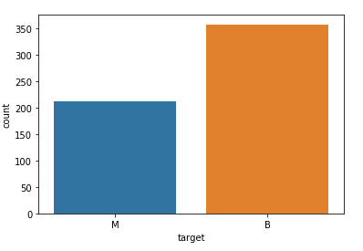

# Python-Breast-Canser-Classification-Gogus-Kanseri-Siniflandirma

### eng : Breast Canser Classification --> Using the Knn algorithm, it detects whether the tumor is benign or malignant in people diagnosed with breast cancer. I got the dataset from <a href="https://www.kaggle.com/uciml/breast-cancer-wisconsin-data">Kaggle </a> It contains 596 rows and 32 columns of tumor shape and specifications.  
### tr : Göğüs Kanseri Sınıflandırma --> Knn algoritmasını kullanarak göğüs kanseri tanısı konulan kişilerde, tümörün iyi huylu mu - kötü huylu mu olduğunu tespit etmektedir. Kullandığımız veri setine  <a href="https://www.kaggle.com/uciml/breast-cancer-wisconsin-data">buradan</a> ulaşabilirsiniz

<h4>Benign and Malignant tumor (iyi huylu ve kötü huylu tümör)</h4>

</img>
