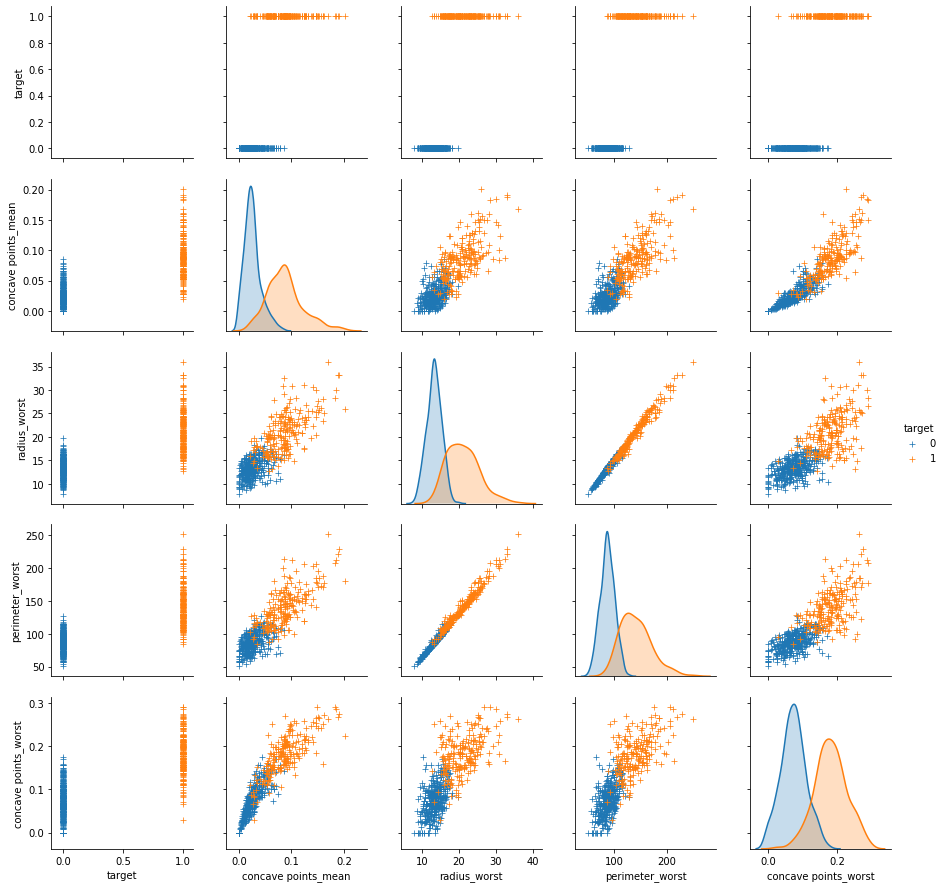
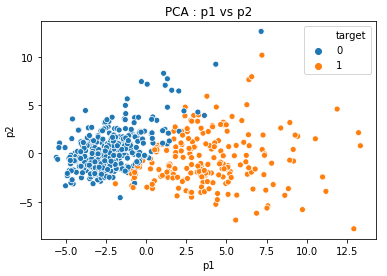
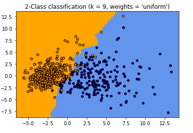
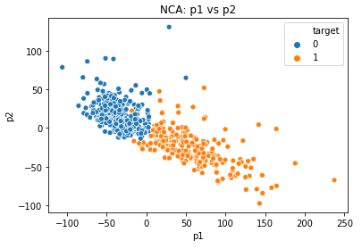
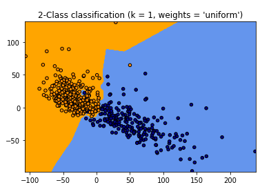
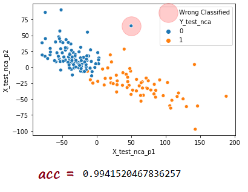

# Python-Breast-Cancer-Classification-Gogus-Kanseri-Siniflandirma

### eng : Breast Cancer Classification --> Using the Knn algorithm, it detects whether the tumor is benign or malignant in people diagnosed with breast cancer. I got the dataset from <a href="https://www.kaggle.com/uciml/breast-cancer-wisconsin-data">Kaggle </a> It contains 596 rows and 32 columns of tumor shape and specifications.  
### tr : Göğüs Kanseri Sınıflandırma --> Knn algoritmasını kullanarak göğüs kanseri tanısı konulan kişilerde, tümörün iyi huylu mu - kötü huylu mu olduğunu tespit etmektedir. Kullandığımız veri setine  <a href="https://www.kaggle.com/uciml/breast-cancer-wisconsin-data">buradan</a> ulaşabilirsiniz

<ul>
  <li> <h3>Benign and Malignant tumor (iyi huylu ve kötü huylu tümör)</h3> </li>  

</img>

  <li> <h3>We take a look at our features (Özelliklerimize göz atıyoruz)</h3> </li>  
  
  </img>
  
  <li> <h3>We take a look at the distribution of benign and malignant tumors after PCA.. (PCA sonrası iyi huylu ve kötü huylu tümör dağılımına göz atıyoruz)</h3> </li>  
  
  </img>
  </img>  
  
  <li> <h3>We take a look at the distribution of benign and malignant tumors after NCA. (NCA sonrası iyi huylu ve kötü huylu tümör dağılımına göz atıyoruz)</h3> </li>  
  
  </img>
  </img>  
  
  <li> <h3>After we have done the classification, we look at our predictions. (Sınıflandırma işlemini yaptıktan sonra, tahminlerimize bakıyoruz.)</h3> </li>  
  
  </img>
</ul>
